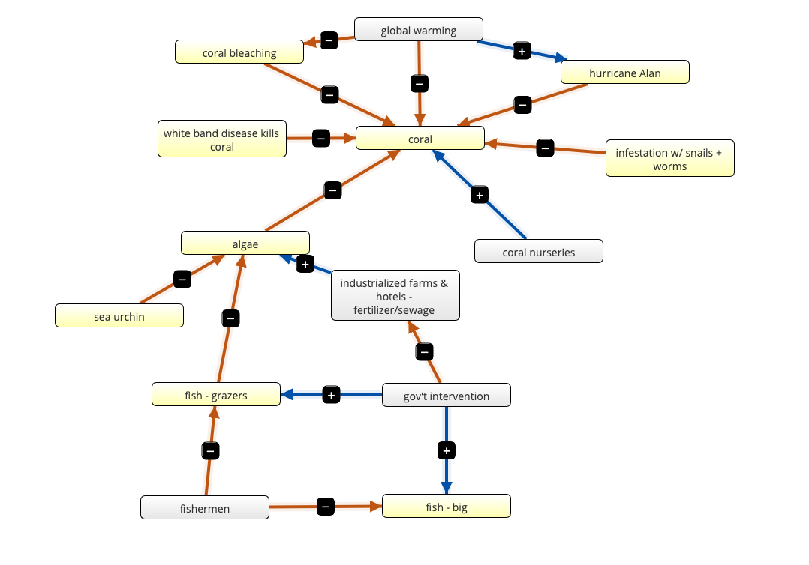
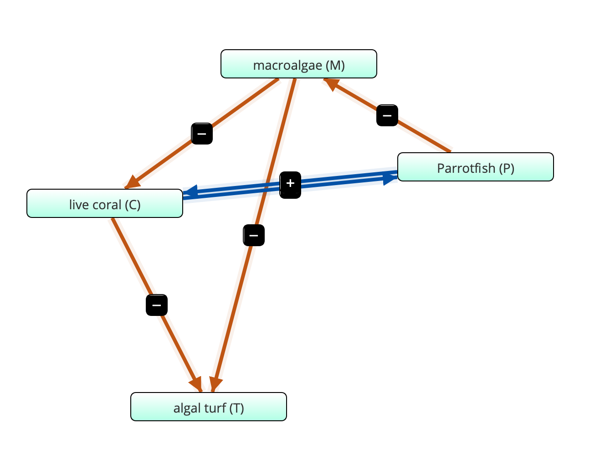
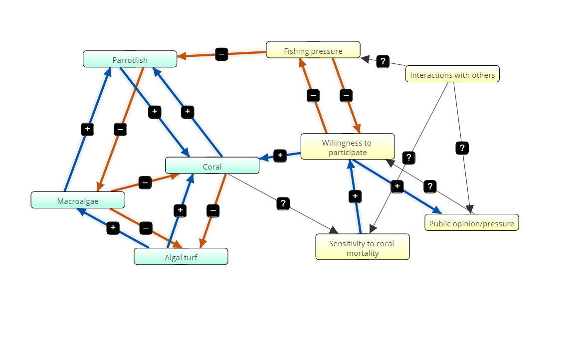

**Part A**
**Our Consensus Flow Diagram**

```{r echo=FALSE}



```
**#3**
**Flow diagram for coral reef system**

```{r echo=FALSE}

```

In this flow diagram, macroalgae grows on top of coral, which is a negative effect for the coral. Coral grows on algal turf, which negatively effects the algal turf. Parrotfish eat the macroalgae, negatively effecting macroalgae. Macroalgae can grow over algal turf, which negatively impacts the algal turf. Parrotfish have an indirect positive effect on coral by eating the algae smothering the coral, and coral has an indirect positive effect on parrotfish by providing a substrate for macroalgae, which parrotfish eat, to grow on. 

```{r echo=FALSE}
read.csv("coral_variables.csv")
```

**# 4: Program the Model**  

  Growth rates for all 4 organisms plotted separately 
  
```{r} 

require(deSolve)
## Loading required package: deSolve

## This first one is for coral. You can change the values as you like and see how coral's growth rate is influenced. I am confused on what 'state' does?

coral_state <- c(C = .75, M = .125, R = .125, P = 1) ## Initial starting states; state should add up to 1 (disregard parrotfish)
times <- seq(0,100, by = 0.1)

# Parameters
coral_parameters <- c(a = 0.1,g = 0.8, d = 0.44,r = 1, s = 0.49) ### parameters stay constant


# Model
coral <- function(t,coral_state,coral_parameters){
  with(as.list(c(coral_state,coral_parameters)),{
       dC <- (r*R*C) - (d*C) - (a*M*C)
       dT <- (P*M/(M+R) - (g*M*R) - (r*R*C) + (d*C))
       dM <- ((a*M*C) - ((P*M)/(M+R)) + (g*M*R))
       dP <- (s*P)*(1- (P/(C)))
      list(c(dC, dT, dM, dP))   
  })}

# Solve model and plot results
out1 <- ode(y = coral_state, times=times, func=coral, parms=coral_parameters)
par(mfrow=c(2,2))
coralplot <- plot(out1[,1],out1[,2],ylab='Coral',xlab='time',las=1, pch = 19)
coralplot <- plot(out1[,1],out1[,3],ylab='Algal Turf',xlab='time',las=1, pch = 19)
coralplot <- plot(out1[,1],out1[,4],ylab='Macroalgae',xlab='time',las=1, pch = 19)
coralplot <- plot(out1[,1],out1[,5],ylab='Parrotfish',xlab='time',las=1, pch = 19)
```


``` {r}
### Algal Turf

turf_state <- seq(C = .25, M = .25, R = .25, P = .25)## I think 10 and 50 may be an equilibrium point
times <- seq(0,100,by=1)

# Parameters
turf_parameters <- c(a = 0.1,g = 0.8, d = 0.44,r = 1, s = 0.49, M = .5, P = .5, C = .5, R = .4)

# Model
turf <- function(t,turf_state,turf_parameters){
  with(as.list(c(turf_state,turf_parameters)),{
       dT <- (P*M/(M+R) - (g*M*R) - (r*R*C) + (d*C))
      list(c(dT))   
  })}

# Solve model and plot results
out1 <- ode(y = turf_state, times=times,func= turf, parms=turf_parameters)
par(mfrow=c(1,1))
plot(out1[,1],out1[,2],ylab='Turf',xlab='time',las=1, pch = 19)

```

``` {r}

### Macro algae

macro_state <- seq(C = .25, M = .25, R = .25, P = .25)
times <- seq(0,100,by=1)

# Parameters
macro_parameters <- c(a = 0.1,g = 0.8, d = 0.44,r = 1, s = 0.49, R = .5, P = .5, C = .5, M = .5)

# Model
macro <- function(t,macro_state,macro_parameters){
  with(as.list(c(macro_state,macro_parameters)),{
       dM <- ((a*M*C) - ((P*M)/(M+R)) + (g*M*R))
      list(c(dM))   
  })}

# Solve model and plot results
out1 <- ode(y = macro_state, times=times,func=macro,parms=macro_parameters)
#par(mfrow=c(1,1))
plot(out1[,1],out1[,2],ylab='Macro',xlab='time',las=1, pch = 19)

```

``` {r}

### Parrotfish

parrot_state <- c(P = .5)
times <- seq(0,100,by=1)


# Parameters
parrot_parameters <- c(a = 0.1,g = 0.8, d = 0.44,r = 1, s = 0.49, C = .1)

# Model
parrot <- function(t, parrot_state, parrot_parameters){
  with(as.list(c(parrot_state,parrot_parameters)),{
       dP <- (s*P)*(1- (P/(C)))
      list(c(dP))   
  })}

# Solve model and plot results
out1 <- ode(y = parrot_state, times=times, func=parrot, parms= parrot_parameters)
par(mfrow=c(1,1))
plot(out1[,1],out1[,2],ylab='Parrotfish',xlab='time',las=1, pch = 19)


```

**#5**
#Produce figures and design analyses to address the following questions: 
**(a) What are the long-term dynamics of the system with the default parameters given below?**
  - The long term dynamics are dependent upon the population sizes of macroalgae, algal turf, parrotfish, and coral.

**(b) What are the most important parameters in determining the long-term dynamics?**
  - Coral is one of the most important parameters in determining the long-term dynamics; it influences the growth of every other organism in the system.


``` {r}
### Below, I am trying to make For loops to test our models at different parameters. This first one shows how parrotfish population changes in response to coral population changes.

x <- seq(0,1, by = 0.1) ### variable that changes, in this case, coral.

## Below parameters do not change
s <- as.numeric(s <- 0.49)
a <- as.numeric(a <- 0.1)
g <- as.numeric(g <- 0.8)
d <- as.numeric(d <- 0.44)
r <- as.numeric(r <- 1)

## Below parameters can be changed
M <- as.numeric(M <- 0.5)
C <- as.numeric(C <- 0.5)
P <- as.numeric(P <- 0.5)
R <- as.numeric(R <- 0.8)

## Creating the function

parrot <- function(pop){
       dP <- (s*P)*(1- (P/(x)))
      list(c(dP))   
  }

### The below for loop explores what the parrotfish population 

parrotpop <- c()
for( i in x){
  parrotpop <- parrot(i)
}
print(parrotpop)
 

x <- as.data.frame(x)
parrotpop <- as.data.frame(parrotpop)

parrot_plot <- cbind(x, parrotpop)
plot(parrot_plot, xlab = 'Coral', ylab = 'Parrotfish')  ## as coral increases, so does parrotfish populations


```

```{r}

### For loop for coral populations. You can change the variables by substituting x in for R, C, or M. Note - if you make substitution make sure you also change the name of the x-axis.

x <- seq(0,1, by = 0.1) ### variable that changes, in this case.

## Below parameters do not change
s <- as.numeric(s <- 0.49)
a <- as.numeric(a <- 0.1)
g <- as.numeric(g <- 0.8)
d <- as.numeric(d <- 0.44)

## Below parameters can be changed
M <- as.numeric(M <- 0.5)
C <- as.numeric(C <- 0.5)
P <- as.numeric(P <- 0.5)
R <- as.numeric(R <- 0.8)


# Creating the function
coral <- function(pop){
       dC <- (r*x*C) - (d*C) - (a*M*C)
      list(c(dC))   
  }

# Creating the loop
coralpop <- c()
for( i in x){
  coralpop <- coral(i)
}
print(coralpop)
 
# Making the plot
x <- as.data.frame(x)
coralpop <- as.data.frame(coralpop)

coral_plot <- cbind(x, coralpop)
plot(coral_plot, xlab = 'Algal Turf', ylab = 'Coral')

```

```{r}

### For loop for algal turf populations. You can change the variables by substituting x in for R, C, or M. Note - if you make substitution make sure you also change the name of the x-axis.

x <- seq(0,1, by = 0.1) ### variable that changes, in this case.

## Below parameters do not change
s <- as.numeric(s <- 0.49)
a <- as.numeric(a <- 0.1)
g <- as.numeric(g <- 0.8)
d <- as.numeric(d <- 0.44)
r <- as.numeric(r <- 1)

## Below parameters can be changed
M <- as.numeric(M <- 0.5)
C <- as.numeric(C <- 0.5)
P <- as.numeric(P <- 0.5)
R <- as.numeric(R <- 0.8)


# Creating the function
turf <- function(pop){
       dT <- (x*M/(M+R) - (g*M*R) - (r*R*C) + (d*C))
      list(c(dT))  
  }

# Creating the loop
turfpop <- c()
for( i in x){
  turfpop <- turf(i)
}
print(turfpop)
 
# Making the plot
x <- as.data.frame(x)
turfpop <- as.data.frame(turfpop)

turf_plot <- cbind(x, turfpop)
plot(turf_plot, xlab = 'Parrotfish', ylab = 'Algal Turf')

```

```{r}

### For loop for macroalgae populations. You can change the variables by substituting x in for R, C, or M. Note - if you make substitution make sure you also change the name of the x-axis.

x <- seq(0,1, by = 0.1) ### variable that changes, in this case.

## Below parameters do not change
s <- as.numeric(s <- 0.49)
a <- as.numeric(a <- 0.1)
g <- as.numeric(g <- 0.8)
d <- as.numeric(d <- 0.44)
r <- as.numeric(r <- 1)

## Below parameters can be changed
M <- as.numeric(M <- 0.5)
C <- as.numeric(C <- 0.5)
P <- as.numeric(P <- 0.5)
R <- as.numeric(R <- 0.5)


# Creating the function
macro <- function(pop){
       dM <- ((a*M*x) - ((P*M)/(M+R)) + (g*M*R))
      list(c(dM)) 
  }

# Creating the loop
macropop <- c()
for( i in x){
  macropop <- macro(i)
}
print(macropop)
 
# Making the plot
x <- as.data.frame(x)
macropop <- as.data.frame(macropop)

macro_plot <- cbind(x, turfpop)
plot(turf_plot, xlab = 'Coral', ylab = 'Macroalgae')

```

**Part B**

**#6.Describe the ecological aspects of the system to the other team. You should help them understand the different components that are integral to the ecology and what outputs and insights come from your model. Have the other team describe the social aspects ofthe system in depth.**

**#7.Build a consensus flow diagram that combines the ecological and social models together.**

```{r echo=FALSE}



```


**#8.As a group, what do you predict will happen to the long-term dynamics when you couple the social and ecological systems together? Which parameters do you anticipate will be the most important for determining overall system dynamics?**

Coupling the social and ecological systems together changes some of our expectations for the long-term dynamics of the overall system. The social system has the ability to influence the health of the ecological system. For example, if more people are willing to participate in conservation, more focus will be put on protecting corals and parrotfish. If, on the other hand, less people are willing to participate or value the short-term economic benefits of hunting smaller fish, like parrotfish, the ecological system may continue on its path to collapse.


**#9.Program the following model in R. Be sure to understand how the model is being coupled together. This is the same model you worked with in part A, but with the inclusion of the x-variable, which is the fraction of conservationists present in the population. The social dynamics team should help you with the interpretations of this equation.**

-> The more coral and more parrotfish, the less conservation opinion. Conservation opinion grows as macroalgae does.

```{r}

require(deSolve)

pars <- c(a = 0.01, gamma = 0.8, r = 1.0, d = 0.44, s = 1, sigma = 0.5, kappa= 1.014, j=1.68, sigma = 0.5, phi = 0.2)

#pars <- c(a = 0.1, gamma = 0.8, r = 1.0, d = 0.44, s = 0.49, sigma = 0.5, kappa= 1.014, j=1.68, sigma = 0.5, phi = 0.2) ### original values

yini  <- c(M = 0.2, C = 0.6, T = .2, P = 5, X = .9)
times <- seq(0, 100, by = 0.1)

coupled_model <- function(Time, State, Pars) {
  with(as.list(c(State, Pars)), {
    dM <-  a*M*C - (P*M)/(M+T) + gamma*M*T
    dC <-  r*T*C - d*C - a*M*C
    dT <- (P*M)/(M+T) - gamma*M*T - r*T*C + d*C
    dP <- s*P*(1 - P/C) - sigma*P*(1 - X)
    dX <- kappa*X*(1 - X)*(-1 + j*(1 - C) - sigma*P*(1 - X) + phi*(2*X - 1))
    return(list(c(dM,dC,dT,dP,dX)))  
  })
}

out   <- ode(yini, times, coupled_model, pars)

par(mfrow=c(1,2))
matplot(out[ , 1], out[ , 2:5], type = "l", xlab = "time", ylab = "Percent cover",main = "Ecological dynamics", lwd = 2,ylim=c(0,1))
legend('topright',legend = c('macroalgae','coral reef','turf algae','parrotfish'),col = c(1,2,3,4),pch = 18)

matplot(out[ , 1], out[ , 6], type = "l", xlab = "time", ylab = "Fraction that are conservationists",main = "Conservation opinion", lwd = 2,ylim=c(0,1),col=5)

```

**#10.Similar to part A, produce figures and design analyses to address the following questions:(a) What are the long-term dynamics of the system with the default parameters given below? (b) What are the most important parameters in determining the long-term dynamics?**

a. 

The long-term dynamics for this reef do not look very good if the parameters are not changed. Macroalgae, even when parrotfish population is set to small or large values (0.01 - 50) and coral makes up 75% of the cover, macroalgae takes over the coral. As macroalgae grows, however, so does conservation opinion. Conservation opinion seems to have grown too late to create change in this ecosystem.

Increasing the growth rate of the parrotfish population, s, can greatly change the long-term dynamics of this system.

b. 

It seems as though macroalgae plays an important part in the long-term dynamics. If its population starts low, parrotfish quickly loose their food source. As soon as the parrotfish disappear, macroalgae growth takes off, which causes algal turf and coral populations to drop drastically.

Parrotfish growth rate is important in determing long-term dynamics. Increasing their growth rate will reduce macroalgae growth and stabilize both algal turf and coral populations.

**Part C**
**Discussion**

**#11.How did your predictions about the coupled socio-ecological systems line up with the results from the model? How did your results line up with the original modeling paper?**

I don't believe our initial predictions aligned well with this model if the original parameters were kept. Our group predicted parrotfish, coral, and willingness to participate would be the most influential drivers in this socio-ecological system. In comparison, macroalgae seems to drive the long term dynamics of this system if no parameters were changed. No matter how I change the parameters in 'yini', the macroalgae always grows exponentially while the other organisms die off. Willingness to participate grows as the macroalgae does, but it seems as though the willingness to participate increases after anything can actually be done to protect the coral. Unfortunately, it often seems something drastic must occur to nature before humans change their willingness to participate.

Our initial predictions did align with the model after increasing parrotfish population growth. Parrotfish proved to be important in reducing macroalgae and stabilizing coral and algal turf. It is still interesting that as parrotfish and coral populations grow, willingness to participates declines. It would be interesting to try to understnad how to keep people enthusiastic even when the coral reef is healthy.


**#12.How did your flow diagrams change over the course of the lessons? What did you learn through the process of developing flow diagrams with others?**

Our first flow diagram was relatively complex. Our second diagram lost much of its complexity and was therefore easier to model. Joining up with the social team, however, added complexity to our flow diagram. Our diagrams were very circular and not linear. The non-linear nature of our flow diagrams displays how complex interactions really are; if you can just one parameter, it's effects may be felt directly by multiple other parameters, which this model displays.

**#13.What were the limitations of the coupled socio-ecological model used here? What changes would you make to the model?**

Limitations of the coupled socio-ecological model may include the un-predictability of humans. Historically, human behavior is difficult to study. Unforeseen outside influences could potentially cause a large surge in support for conservation, or a large drop. Economics play a large part in human values, and I believe adding a parameter which models the local economics would increase the value of our model.

This model also does not take into account disease. An outbreak of disease in any of the species in this model could drastically change the long-term dynamics of this system. If possible, I would include a segment including the probability of disease in this system. I would also want to include any other potential predators of macroalgae, do only parrotfish consume marcoalgae? Or does macroalgae have other predators?


**#14.What aspects of this assignment were most or least useful? How would you improve this assignment?**

Working with this code was the most useful to me personally. I feel as though I am still building up my arsenal of R tools, and I will definitely be saving this code to hopefully use in future projects.

The equations were also useful for me - historically, I have always avoided math, but I am finding myself more and more drawn to quantitative analysis. I enjoyed going through each section of the equations and trying to determine how each segment influenced the others.

And of course, coral reefs are such a fun subject to think on. I have my Advanced PADI and can remember a coral fish being the very first fish I saw underwater, but I know almost nothing about coral reefs. I really appreciate the applicableness of each case study provided in this class. I am not only just learning quantitative skills, but also about systems I have never studied.
